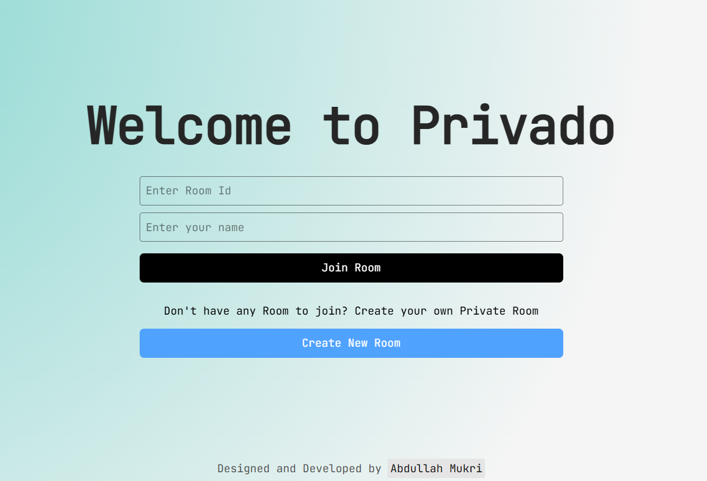

<p align="center">
  
</p>

<h1 align="center">Privado</h1>

<p align="center">
  A secure and private communication platform built with WebSocket technology.
</p>

<p align="center">
  
  
  
</p>

---

## 📚 Overview

> _"Whenever I learn a new language, I build a WebSocket server to grasp it better."_ — Following ThePrimeagen's advice

This repository contains the Privado platform - a secure real-time communication system using Socket.IO. Each implementation demonstrates private messaging, secure rooms, and encrypted event handling.

## 🛠️ Implementations

| Language | Path | Description |
|----------|------|-------------|
| **TypeScript** | [`Typescript/`](./Typescript) | Node.js WebSocket server with Socket.IO 4.8.3 |
| **Client** | [`next-socket-client/`](./next-socket-client) | Next.js 15.2.8 frontend with socket.io-client |

## 🚀 Quick Start

Each implementation has its own README with setup instructions:

- [TypeScript Implementation](./Typescript/Readme.md)
- [Next.js Client](./next-socket-client/README.md)

## 🌐 What You'll Learn

- Socket.IO connection lifecycle and rooms
- Real-time event emission and broadcasting
- Namespace and room management
- Error handling and reconnection strategies
- Client-server bidirectional communication

## 📂 Repository Structure

```
.
├── Typescript/              # TypeScript/Node.js server (Socket.IO)
├── next-socket-client/      # Next.js 15.2.8 client app
└── README.md               # This file
```

## 🤝 Contributing

Feel free to add implementations in other languages or improve existing ones.
